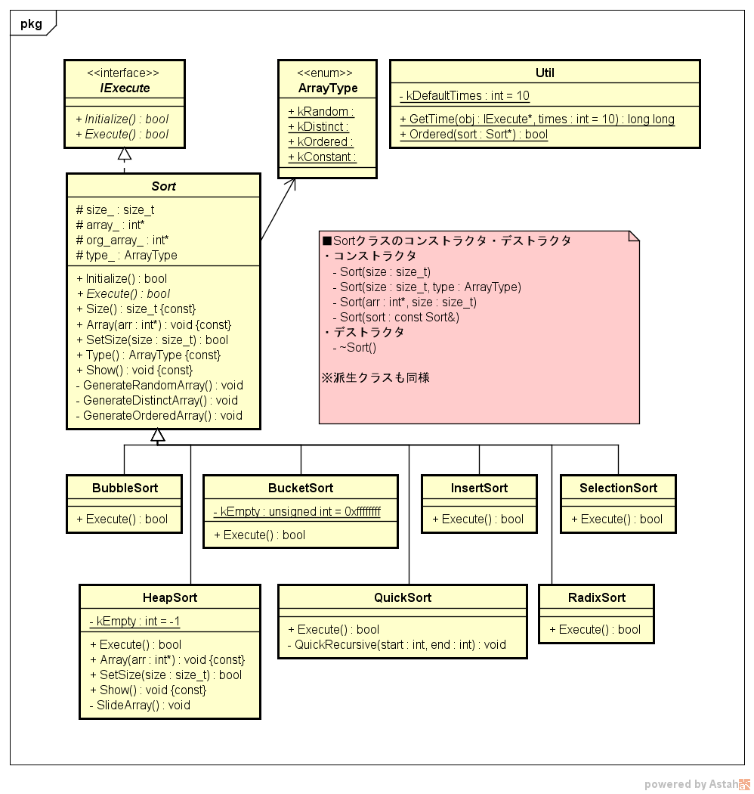

# 設計書
本プロエジェクトの設計書です。  
クラス図と、各クラスの設計書を記載します。  

## 概要
本プロジェクトは、ソートを学ぶためのプロジェクトです。  
ソートアルゴリズムは、その名をもつクラスの機能として定義されます。  
たとえば、BubbleSortクラスがあります。  

それらクラスは、ソートを実行する機能をもつSortクラスを継承します。  
また、Sortクラスは実行する機能を定義したIExecuteインタフェースを継承します。  

## クラス図
クラス図は下記のとおりです。  

## クラス設計書

### IExecuteインタフェース
実行する機能をもつインタフェースクラスです。  
[IExecuteインタフェース](./IExecute.md)

### Sortクラス
ソートを実行する機能をもつ抽象クラスです。IExecuteインタフェースクラスを継承します。  
[Sortクラス](./Sort.md)

### BubbleSortクラス
バブルソートを実行する機能をもつクラスです。Sortクラスを継承します。  
[BubbleSortクラス](./BubbleSort.md)

### BucketSortクラス
バケットソートを実行する機能をもつクラスです。Sortクラスを継承します。  
[BucketSortクラス](./BucketSort.md)

### HeapSortクラス
ヒープソートを実行する機能をもつクラスです。Sortクラスを継承します。  
[HeapSortクラス](./HeapSort.md)

### InsertSortクラス
挿入ソートを実行する機能をもつクラスです。Sortクラスを継承します。  
[InsertSortクラス](./InsertSort.md)

### QuickSortクラス
クイックソートを実行する機能をもつクラスです。Sortクラスを継承します。  
[QuickSortクラス](./QuickSort.md)

### RadixSortクラス
基数ソートを実行する機能をもつクラスです。Sortクラスを継承します。  
[RadixSortクラス](./RadixSort.md)

### ArrayType列挙型
配列のタイプを表す列挙型です。  
[ArrayType列挙型](./ArrayType.md)
